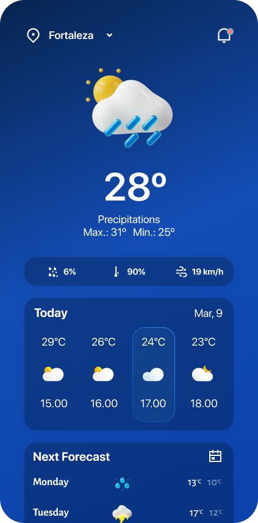
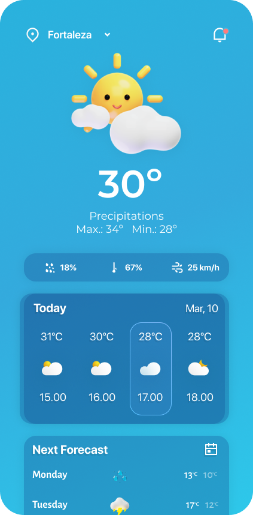

# 🌤️ WeatherApp

WeatherApp — это мобильное приложение на **Flutter**, которое показывает актуальные погодные данные в реальном времени, используя **OpenWeather API**.  
Приложение отображает текущую температуру, прогноз на часы и дни, а также дополнительные параметры: влажность, скорость ветра, вероятность осадков.

---

## 🚀 Возможности
- 🌍 Определение текущего местоположения пользователя через **Geolocator**
- ☀️ Отображение текущей температуры, состояния неба (Clear, Clouds, Rain и т.д.)
- 📊 Прогноз на несколько часов (hourly forecast)
- 📅 Прогноз на неделю (daily forecast)
- 💧 Влажность воздуха
- 🌬️ Скорость ветра
- 🌦️ Вероятность осадков
- 🎨 Красивый UI с градиентным фоном и кастомными иконками

---

## 📸 Скриншоты
<p align="center">
  
  
</p>

---

## 🛠️ Технологии
- [Flutter](https://flutter.dev/) — UI SDK
- [Dart](https://dart.dev/) — язык программирования
- [http](https://pub.dev/packages/http) — работа с API
- [flutter_dotenv](https://pub.dev/packages/flutter_dotenv) — хранение API ключа
- [geolocator](https://pub.dev/packages/geolocator) — получение геопозиции

---

## ⚙️ Установка и запуск

### 1. Клонирование репозитория
```bash
git clone https://github.com/username/weatherapp.git
cd weatherapp
# 🌤️ WeatherApp

WeatherApp — это мобильное приложение на **Flutter**, которое показывает актуальные погодные данные в реальном времени, используя **OpenWeather API**.  
Приложение отображает текущую температуру, прогноз на часы и дни, а также дополнительные параметры: влажность, скорость ветра, вероятность осадков.

---

## 🚀 Возможности
- 🌍 Определение текущего местоположения пользователя через **Geolocator**
- ☀️ Отображение текущей температуры, состояния неба (Clear, Clouds, Rain и т.д.)
- 📊 Прогноз на несколько часов (hourly forecast)
- 📅 Прогноз на неделю (daily forecast)
- 💧 Влажность воздуха
- 🌬️ Скорость ветра
- 🌦️ Вероятность осадков
- 🎨 Красивый UI с градиентным фоном и кастомными иконками

---

## 📸 Скриншоты
<p align="center">
  
  
</p>

---

## 🛠️ Технологии
- [Flutter](https://flutter.dev/) — UI SDK
- [Dart](https://dart.dev/) — язык программирования
- [http](https://pub.dev/packages/http) — работа с API
- [flutter_dotenv](https://pub.dev/packages/flutter_dotenv) — хранение API ключа
- [geolocator](https://pub.dev/packages/geolocator) — получение геопозиции

---

## ⚙️ Установка и запуск

### 1. Клонирование репозитория
```bash
git clone https://github.com/username/weatherapp.git
cd weatherapp
